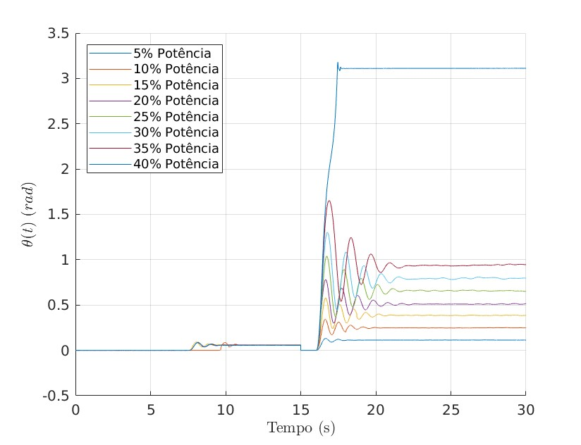
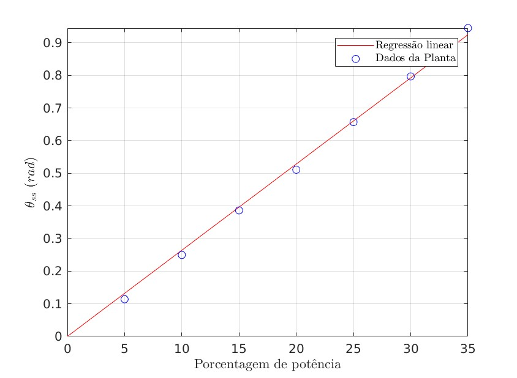
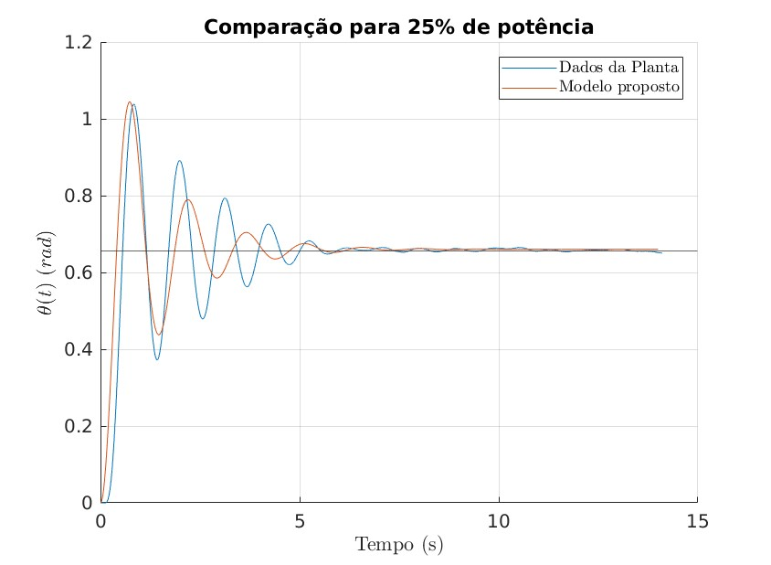

# Primeira entrega: parâmetros do modelo

Inicialmente, optamos por realizar vários testes no sistema, coletando as posições
angulares da haste em relação ao tempo, para diferentes valores de potência fornecida ao motor.

A figura a seguir apresenta o gráfico das diferentes curvas obtidas:

Observa-se que para a potência fornecida de 40%, o sistema atinge um equilíbrio em $\pi = 3.14~rad$.
Isso se dá pois o sistema atinge um ponto de equilíbrio instável em $\frac{\pi}{2}$ radianos.

Consideramos, então, apenas os dados de potência de 5% a 35%, para os quais o sistema atinge um equilíbrio estável.

Visivelmente, vemos que a saída angular $\theta$ se dá de forma quase que proporcional à entrada em potência.

Aqui faremos um pequeno comentário sobre a modelagem matemática do sistema, e em seguida, apresentaremos os resultados obtidos.

### Modelagem Matemática
Embora tenhamos partido da seguinte modelagem matemática para o sistema:

$$ \ddot{\theta}(t) + \beta \dot{\theta}(t) + \alpha \sin(\theta(t)) = \gamma u(t) $$

O ajuste linear em $\theta$ apresentou erros similares,
com o ganho na conveniência algébrica, de modo que optamos por adotar a EDO:

$$ \ddot{\theta}(t) + \beta \dot{\theta}(t) + \alpha \theta(t) = \gamma u(t), $$

sendo $\theta(t)$ o ângulo da haste. Para verificar se o modelo é adequado,
fez-se a análise do problema em seu estado estacionário (equilíbrio),
ou seja, quando as derivadas em $\theta$ se anulam:

$$ \theta_{ss} = \frac{\gamma}{\alpha} \cdot u_{ss}.  $$

Ou seja, para garantir que a dinâmica é coerente, temos que analisar se
a relação do ângulo de equilíbrio($\theta_{ss}$) é diretamente proporcional
ao sinal fornecido ($u$), aqui medido em porcentagem da potência máxima,
por conveniência.

Da regressão linear a seguir, verifica-se uma relação quase linear entre $\theta_{ss}$ e $u_{ss}$:

Ou seja, apesar dos resultados satisfatórios com o seno do ângulo,
podemos aproximar a EDP como sendo linear, sem grandes perdas de resultado.

### Dados obtidos

De forma mais direta, os dados de ângulo no estado estacionário,
para cada sinal de potência fornecido, são:

| Sinal Fornecido ( $u$ ) | Ângulo de Equilíbrio ( $\theta_{ss}$ )| Ângulo de Equilíbrio ( $\theta_{ss}$ )    |
| :------------------: | :--------------------------------------: | :-----------------------------------------: |
|          5%          |              0.1140 rad                  |                6.5317 °                     |
|         10%          |              0.2495 rad                  |               14.2953 °                     |
|         15%          |              0.3862 rad                  |               22.1276 °                     |
|         20%          |              0.5109 rad                  |               29.2724 °                     |
|         25%          |              0.6568 rad                  |               37.6319 °                     |
|         30%          |              0.7926 rad                  |               45.4126 °                     |
|         35%          |              0.9247 rad                  |               52.9814 °                     |

### Hipótese Da linearidade
Assumindo a linearidade da EDP, podemos avaliar a função de transferência,
através de simplificações matemáticas, como:

$$ G(s) = \frac{\Theta(s)}{U(s)} = \frac{\gamma}{s^2 + \beta s + \alpha} $$

Na forma padrão

$$G(s)=\frac{\gamma}{s^2 + 2\xi\omega_n + \omega_n^2} $$

temos

$$\beta = 2\xi\omega_n \quad \text{e} \quad \alpha = \omega_n^2$$

Com isso, podemos avaliar os termos desta função com os conhecimentos obtidos em sala:

$$ M = \frac{\theta_{ss} - \theta_p}{\theta_{ss}}, ~

\exp \left( \frac{-\pi\xi}{\sqrt{1-\xi^2}} \right) \implies

\boxed{ \xi=\sqrt{\frac{\ln(M)^2}{\pi^2-\ln(M)^2}}} $$

sendo $M$ o parâmetro de overshoot do primeiro pico $\theta_p$, em relação a $\theta_{ss}$. Ainda, tomando o tempo de pico como $t_p$:

$$t_p=\frac{\pi}{\omega_n \sqrt{1-\xi^2}} \implies \boxed{\omega_n=\frac{\pi}{t_p \sqrt{1-\xi^2}}}$$

A partir destes valores, podemos obter os parâmetros $\alpha$, $\beta$.
Por fim, obtêm-se o ganho $\gamma$ a partir da relação de equilíbrio inicial:

$$\gamma = \frac{\alpha \cdot \theta_{ss}}{u_{ss}}$$

Para cada valor de entrada de potência $u$ e saída angular $\theta$, tem-se os resultados a seguir:

| $u_{ss}$    | $\theta_{ss}~(rad)$  | $\theta_p~(rad)$ | $t_p ~(s)$ | $M$   | $\xi$  | $\omega_n$ | $\alpha$  | $\beta$ | $\gamma$ |
|:-----------:|:--------------------:|:----------------:|:----------:|:-----:|:------:|:----------:|:---------:|:-------:|:--------:|
| 5%          | 0.1140               |  0.1319          | 0.647      | 15.8% | 0.507  | 5.633      | 31.73     | 5.71    | 0.84     |
| 10%         | 0.2495               |  0.3416          | 0.611      | 36.9% | 0.302  | 5.394      | 29.10     | 3.26    | 0.77     |
| 15%         | 0.3862               |  0.5773          | 0.650      | 49.5% | 0.219  | 4.953      | 24.53     | 2.17    | 0.65     |
| 20%         | 0.5109               |  0.7807          | 0.650      | 52.8% | 0.199  | 4.932      | 24.33     | 1.96    | 0.64     |
| 25%         | 0.6568               |  1.0383          | 0.731      | 58.1% | 0.170  | 4.362      | 19.02     | 1.49    | 0.50     |
| 30%         | 0.7968               |  1.3022          | 0.770      | 63.4% | 0.143  | 4.123      | 17.00     | 1.18    | 0.45     |
| 35%         | 0.9449               |  1.6533          | 0.887      | 75.0% | 0.091  | 3.557      | 12.65     | 0.65    | 0.33     |
    
Por fim, adiciona-se aqui uma comparação entre o modelo obtido e o modelo proposto em segunda ordem:

