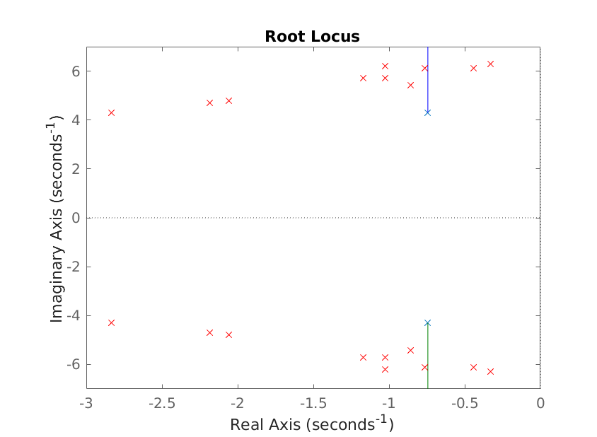

## Tabela com polos de malha fechada para diferentes ganhos $K$

Dados os experimentos realizados na prática passada, com o aeropêndulo, montou-se um modelo de segunda ordem com os seguintes parâmetros:
- $\alpha = 19.0225 $
- $\beta = 1.4867 $
- $\gamma = 0.5026 $

Onde a função de transferência do sistema é dada por:

$$G(s)=\dfrac{\gamma}{s^2+\beta s+\alpha}$$

Resolveu-se, então, testar a eficácia de um controlador proporcional no projeto, numa malha com realimentação negativa. 
A função de transferência em malha fechada $H(s)$ ficou, então:

$$H(s)=\dfrac{K_pG(s)}{1+K_pG(s)} = \dfrac{K_p\gamma}{s^2+\beta s+(\alpha+K_p\gamma)}$$

Para facilitarmos a obtenção de valores plausíveis para $K_p$, foi aplicado o critério de Routh-Hurwitz. Na realidade, o critério acabou não sendo tão útil, visto que o critério teve como resultado uma limitação, já esperada, de que $K_p$ deveria pertencer à $\mathbb{R}$.

### Parte experimental

Na prática, nos limitamos a testar as respostas à degrau para valores de $K_p$'s em faixas razoáveis, que acabaram sendo de 18 a 28. Verificamos, ainda, que para $K_p$'s acima de 28, o sistema oscilava de forma indefinida.

| K  | $\alpha$ | $\beta$ | $\gamma$ |        Raízes         |
|:--:|:--------:|:-------:|:--------:|:---------------------:|
| 18 | 27.1589  | 4.1210  | 0.016696 | $-2.0605 \pm 4.7868i$ |
| 19 | 26.9940  | 4.3737  | 0.016142 | $-2.1868 \pm 4.7129i$ |
| 20 | 26.4609  | 5.6716  | 0.015946 | $-2.8358 \pm 4.2918i$ |
| 21 | 33.7455  | 2.0545  | 0.020507 | $-1.0272 \pm 5.7175i$ |
| 22 | 30.0699  | 1.7187  | 0.017494 | $-0.8594 \pm 5.4158i$ |
| 23 | 30.0859  | 1.7184  | 0.016792 | $-0.8592 \pm 5.4173i$ |
| 24 | 39.7015  | 2.0499  | 0.019624 | $-1.0250 \pm 6.2170i$ |
| 25 | 38.0366  | 1.5318  | 0.019976 | $-0.7659 \pm 6.1196i$ |
| 26 | 37.7102  | 0.87896 | 0.017875 | $-0.4395 \pm 6.1251i$ |
| 27 | 33.8842  | 2.3378  | 0.017791 | $-1.1689 \pm 5.7024i$ |
| 28 | 39.6627  | 0.65929 | 0.017623 | $-0.3296 \pm 6.2892i$ |

### Simulação

Raízes encontradas para K's variados (na prática, simulamos os mesmos valores testados experimentalmente) dada a modelagem do sistema definida na prática anterior.

$$H(s)=\dfrac{K_pG(s)}{1+K_pG(s)} = \dfrac{K_p\gamma}{s^2+\beta s+(\alpha+K_p\gamma)}$$

Encontrando os polos:

| K  |      Polos de $$      | K  |      Polos de $$      |
|:--:|:---------------------:|:--:|:---------------------:|
| 18 | $-0.7434 \pm 5.2456i$ | 24 | $-0.7434 \pm 5.5255i$ |
| 19 | $-0.7434 \pm 5.2933i$ | 25 | $-0.7434 \pm 5.5708i$ |
| 20 | $-0.7434 \pm 5.3405i$ | 26 | $-0.7434 \pm 5.6158i$ |
| 21 | $-0.7434 \pm 5.3874i$ | 27 | $-0.7434 \pm 5.6603i$ |
| 22 | $-0.7434 \pm 5.4338i$ | 28 | $-0.7434 \pm 5.7045i$ |
| 23 | $-0.7434 \pm 5.4799i$ |    |                       |

### Gráfico com os polos de malha fechada plotados

Percebe-se que dentro o lugar geométrico das raízes do sistema realimentado não condizeu muito com o 

## Atualizações no modelo

Foi necessário atualizar o modelo, adicionando um polo adicional, referente à dinâmica do motor, o polo $p_m$. Este polo não havia sido considerado anteriormente, e teve seu valor encontrado de forma heurística.

A nova função de transferência $G(s)$ fica como:

$$G(s)=\frac{\gamma}{s^2+\beta s+\alpha} \cdot \frac{1}{1+a_ms}$$

Atualizando o modelo, podemos novamente encontrar valores de alpha, beta, gamma e pm a partir dos dados da prática passada. Com isso, podemos melhor analisar o comportamento do sistema com o controlador proporcional.

### Encontrando uma nova planta

Após otimizar os parâmetros do novo modelo, obtemos:

$$\alpha = 19.0225$$
$$\beta = 1.4867$$
$$\gamma = 0.5026$$
$$a_m = 0.1$$

### Experimentando com o novo modelo para verificar a adequação às respostas degrau

<!---
Perguntar pra rapazeada
-->