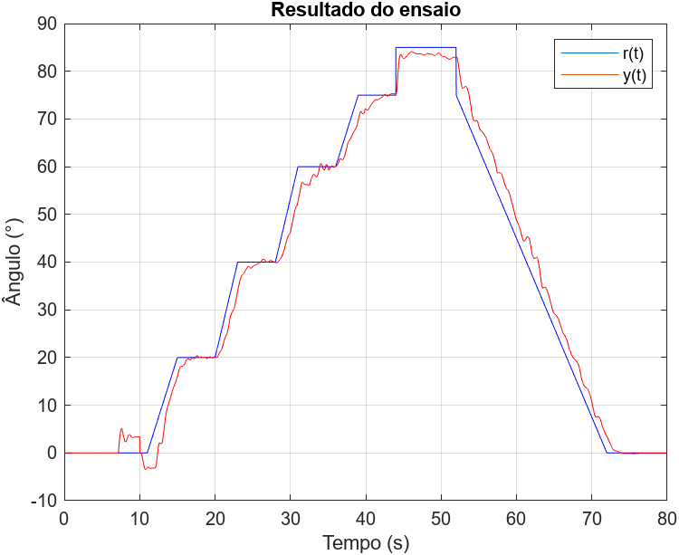

# Lab4

## Formulário

Modelo não-linear do aeropêndulo:

$$ \ddot{\theta}(t) = -\alpha \sin(\theta(t)) -\beta \dot{\theta}(t) + \gamma u(t) $$

Modelo linear do aeropêndulo em torno de ($\bar{u}, \bar{\theta}$):

$$ G(s) = \frac{\theta(s)}{U(s)} = \frac{\gamma}{s^2 + \beta s + \alpha \cos(\bar{\theta})} \frac{1}{\frac{1}{5}s + 1} $$

**Atenção** para o polo localizado em $s = -5$. Ele representa a dinâmica do motor. Ele vai te atrapalhar bastante. Mas também vai ajudar na taxa de sucesso na bancada.

## Equipe de laboratório 13h30-15h10

Analisando-se os [gráficos](../resultados/time-1/lab-4/imagens/) conforme discutido [aqui](../resultados/time-1/lab-4/README.md), tem-se que o comportamento mais aproximado do desejado, é o representado na figura abaixo.

  

### Funções de transferência
Assim, tem-se as funções de transferências para cada um dos ângulos.
PID 15°: Kd = 2.2657; Ki = 43.9760; Kp = 2.4856

$$ T_{15}(s) = 47.8 \frac{s^2 + 1.96s + 18.4}{s^2 + 20s} $$

PID 37.5°: Kd = 2.5275; Ki = 35.9433; Kp = 3.4997

$$ T_{37.5}(s) = 54.05 \frac{s^2 + 1.96s + 13.3}{s^2 + 20s} $$

PID 55°: Kd = 2.9952; Ki = 25.8296; Kp = 5.0766

$$ T_{55}(s) = 64.98 \frac{s^2 + 1.96s + 7.95}{s^2 + 20s} $$

PID 70°: Kd = 9.2023; Ki = 20.5944; Kp = 18.8545

$$ T_{70}(s) = 202.9 \frac{s^2 + 1.96s + 2.03}{s^2 + 20s} $$

PID 85°: Kd = 1.7946; Ki = 4.0164; Kp = 3.6770

$$ T_{85}(s) = 39.57 \frac{s^2 + 1.96s + 2.03}{s^2 + 20s} $$

## Equipe de laboratório 15h30-17h10

Poste aqui a função de transferência dos seus controladores.

## Objetivos

O objetivo desse encontro é:

- projeto de PID usando Lugar Geométrico das Raízes
- identificar modelo de sistemas instáveis em malha aberta

## Pré-Lab

### O grupo deve apresentar esse pré-lab antes de iniciar o experimento

Projete controladores (sugestão: PIDs) de modo que a resposta a um degrau (em malha fechada) tenha as seguintes características:

 - $t_e \leq 2$ s
 - $M_p \leq 10$ %
 - erro de regime menor que 5%

Cada grupo deve alocar os polos de malha fechada em uma determinada posição. Não pode haver posições repetidas. Eu aloquei em $s = -2,3 \pm j1$. Considere os seguintes pontos de operação:

1. 15º - obrigatório
2. 37,5º - obrigatório
3. 55º - obrigatório
4. 70º - obrigatório
5. 85º - obrigatório
6. 100º - desafio
7. 117,5º - desafio
8. 145º - desafio

Veja esse vídeo sobre [ajuste de ganhos](https://www.youtube.com/watch?v=YiUjAV1bhKs). Depois que o seu grupo tiver projetado os controladores, implemente a lei de controle que combina todos os controladores projetados. Teste com o modelo não-linear do aeropêndulo. Uma possível solução encontra-se na pasta lab4/projeto. A sua lei de controle precisa sobreviver ao sinal de referência disponível naquela pasta!

### Dicas

- Você não é obrigado a usar um PID completo, ele pode ser apenas um PD ou então um PID + pinduricalhos
- Você pode fazer uso de pré-filtro
- Não use polos ou zeros maiores que $s = -30$
- Selecionar um único par complexo conjugado de polos dominantes de malha fechada para todos os projetos (do grupo) é uma boa ideia
- Observe o sinal de controle, se for maior que 80%, provavelmente não vai funcionar na bancada
- Utilize a ferramenta rltool para fazer os projetos
- Utilize o LGR para fazer os projetos

## No laboratório

### O que eu preciso fazer?

Provar que a sua lei de controle funciona.

## Obtendo os ganhos do PID

Uma possível função de transferência de um PID é

$$
 \left.\begin{aligned}
        G(s) = \frac{U(s)}{E(s)} &= K_p + \frac{K_i}{s} + \frac{sNK_d}{s+N} \\
        &= \frac{(K_p+NK_d)s^2 + (NK_p + K_i)s + NK_i}{s(s+N)} 
       \end{aligned}
 \right.
$$

Normalmente, ao projetar o PID usando o LGR, você acaba obtendo uma função de transferência como:

$$
G(s) = \frac{as^2 + bs + c}{s(s+N)}
$$

Os ganhos $K_p$, $K_i$ e $K_d$ podem ser obtidos resolvendo o seguinte sistema linear:

$$
\left[ \begin{array}{ccc}
1 & 0 & N \\
N & 1 & 0 \\
0 & N & 0
\end{array} \right]
\left[ \begin{array}{c}
K_p \\
K_i \\
K_d
\end{array} \right] =
\left[ \begin{array}{c}
a \\
b \\
c
\end{array} \right]
$$

## Implementando o PID em código

Existem **muitas** formas de se implementar um PID. Como precisamos combinar vários PIDs, será muito vantajoso escrever as EDOs que representam o PID e então combiná-las com uma interpolação, por exemplo. Supondo que o PID está na forma

$$
G(s) = \frac{as^2 + bs + c}{s(s+N)}
$$

Então as EDOs são:

$$
\left[ \begin{array}{c}
\dot{x}_1(t) \\
\dot{x}_2(t)
\end{array} \right]=
\left[ \begin{array}{cc}
0 & 1 \\ -e & -d
\end{array} \right]
\left[ \begin{array}{c}
x_1(t) \\ x_2(t)
\end{array} \right]+
\left[ \begin{array}{c}
0 \\ 1
\end{array} \right] u(t)
$$
$$
y(t) =
\left[ \begin{array}{cc}
(c- ea) & (b-da) 
\end{array} \right]
\left[ \begin{array}{c}
x_1(t) \\ x_2(t)
\end{array} \right]+
a u(t)
$$

Note $x_1(t)$ e $x_2(t)$ representam o estado interno do PID.

## Vídeo explicativo

