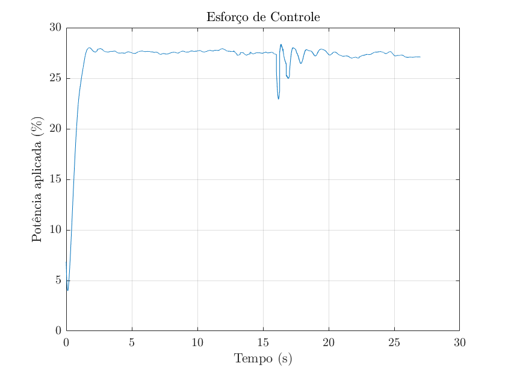
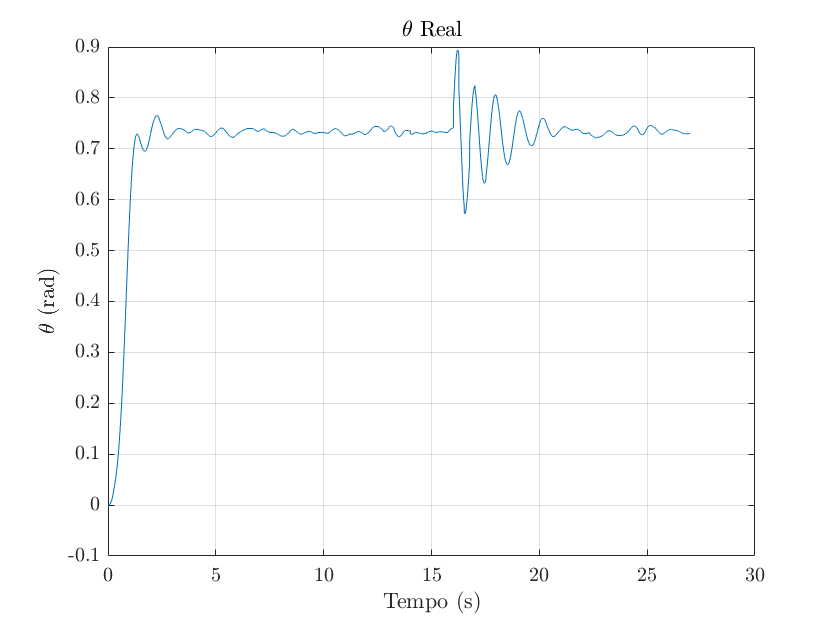
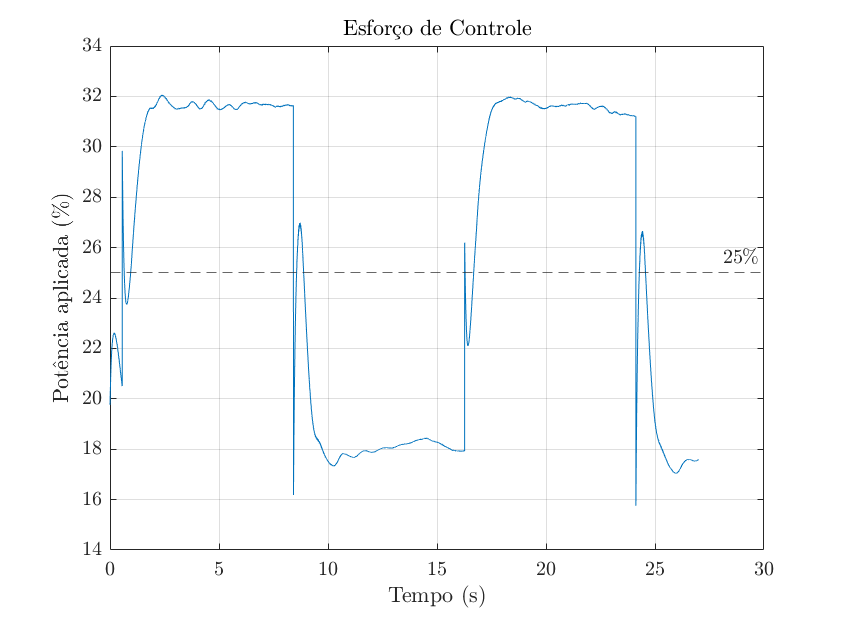
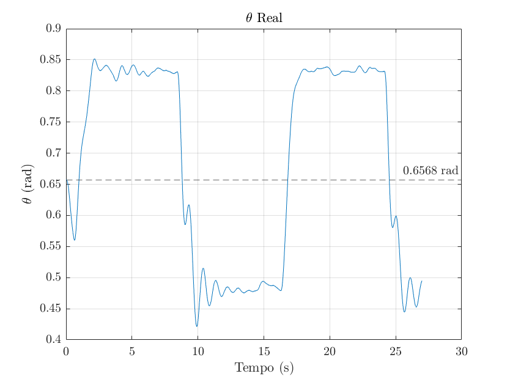

### Planta utilizada no design dos controladores

Modelo de planta utilizado:

$$G(s)=\frac{\gamma}{s^2+\beta s+\alpha} \cdot \frac{1}{1+a_ms}$$

Após otimizar os parâmetros do novo modelo, na segunda prática, obtemos os seguintes valores para $\alpha$, $\beta$, $\gamma$ e $a_m$, considerando diferentes valores iniciais para o estado estacionário do sistema, bem como diferentes valores para o degrau:

| $\theta_0$  | $\alpha$ | $\beta$ | $\gamma$ | $a_m$ |
|:-------:|:--------:|:--------:|:-------:|:---------:|
| 5  + 10 | 36.4553  | 0.9520   | 1.0573  | 0.18815   |
| 15 + 10 | 30.5073  | 1.0717   | 0.8825  | 0.18181   |
| 25 + 10 | 24.02969 | 1.5489   | 0.6915  | 0.13342   |
| 35 +  5 | 16.2091  | 2.0818   | 0.4647  | 0.045157  |

### Controladores PID projetados

> yapping goes here

### Resultados de simulação

Teste de simulação para um degrau de amplitude *:

Posteriormente, foi realizada uma simulação para uma entrada composta por um sinal estacionário de 25% de potência, somado a uma onda quadrada de 10% de potência como amplitude. Os resultados obtidos estão apresentados a seguir:

