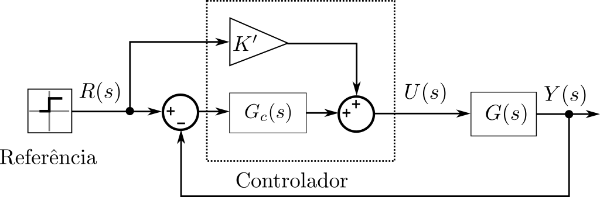

# Lab5

## Formulário

Modelo não-linear do aeropêndulo:

$$ \ddot{\theta}(t) = -\alpha \sin(\theta(t)) -\beta \dot{\theta}(t) + \gamma u(t) $$

Modelo linear do aeropêndulo em torno de ($\bar{u}, \bar{\theta}$):

$$ G(s) = \frac{\theta(s)}{U(s)} = \frac{\gamma}{s^2 + \beta s + \alpha \cos(\bar{\theta})} \frac{1}{\frac{1}{5}s + 1} $$

**Atenção** para o polo localizado em $s = -5$. Ele representa a dinâmica do motor. Ele vai te atrapalhar bastante. Mas também vai ajudar na taxa de sucesso na bancada.

## Equipe de laboratório 13h30-15h10

Poste aqui a função de transferência dos seus controladores.

## Equipe de laboratório 15h30-17h10

A partir do novo modelo linear do aeropêndulo, dado pela função de transferência abaixo: 

$$ G(s) = \frac{\theta(s)}{U(s)} = \frac{\gamma}{s^2 + \beta s + \alpha }\frac{1}{\frac{1}{5}s + 1} $$ 

Recalculou-se os parâmetros $\alpha$, $\beta$, $\gamma$  de cada grupo.
  
### Resultados

Dessa forma, obteve-se os seguintes parâmetros para $\alpha$, $\beta$ e $\gamma$:

|  $\overline{y}$  | $\alpha_1$ | $\alpha_2$ | $\alpha_3$ | $\alpha_4$ | $\alpha_{médio}$ |
|:---:|:----------:|:----------:|:----------:|:----------:|:----------------:|
| 20º |    20,69   |    18,06   |    18,98   |    19,73   |    19,37    |
| 40º |    15,53   |    17,47   |    15,03   |    17,96   |    16,50    |

|  $\overline{y}$  | $\beta_1$ | $\beta_2$ | $\beta_3$ | $\beta_4$ | $\beta_{médio}$ |
|:---:|:---------:|:---------:|:---------:|:---------:|:---------------:|
| 20º |   2,47   |    1,95   |    2,36   |    1,80   |       2,14       |
| 40º |   1,15   |    0,66   |    1,29   |    2,94   |       1,51       |

|  $\overline{y}$  | $\gamma_1$ | $\gamma_2$ | $\gamma_3$ | $\gamma_4$ | $\gamma_{médio}$ |
|:---:|:---------:|:---------:|:---------:|:---------:|:---------------:|
| 20º |   0,59    |    0,47   |    0,54   |    0,09   |       0,42      |
| 40º |   0,43    |    0,70   |    0,40   |    0,09   |       0,40      |

Em resumo, os valores médios encontrados para os parâmetros de todos os ensaios realizados foram:

$\alpha$ | $\beta$ | $\gamma$ |
:---------:|:---------:|:---------:|
|  17,94    |   1,82   |    0,41   |  

## Objetivos

- projeto de controladores usando Lugar Geométrico das Raízes
- aumentando a robustez do projeto com o Lugar Geométrico das Raízes

## Pré-Lab

### O grupo deve apresentar esse pré-lab antes de iniciar o experimento

#### Exercício 1

Suponha que uma tarefa de controle consiste em rastrear uma entrada do tipo degrau. Além disso, sabe-se que tanto a planta $G(s)$ quanto o controlador $G_c(s)$ não possuem integradores em seus modelos. Dado a seguinte malha de controle

 

calcule $K'$ de modo que o erro em regime permanente seja zero, sem o uso de integradores.

Entregável

- A demonstração matemática

#### Exercício 2

Projete controladores de modo que a resposta a um degrau (em malha fechada) tenha as seguintes características:

 - $t_e \leq 2$ s
 - $M_p \leq 20$ %
 - $\max |u(0)| \leq 80$% para uma referência do tipo degrau com amplitude de 10º
 - adicione um elo de *feedforward*, sendo proibido o uso de integradores

Cada grupo deve alocar os polos de malha fechada em uma determinada posição. Não pode haver posições repetidas. Considere os seguintes pontos de operação:

1. 15º - obrigatório
2. 30º - obrigatório
3. 40º - obrigatório
4. 50º - obrigatório
5. 60º - obrigatório
6. 70º - obrigatório

Entregáveis

- As funções de transferência dos controladores
- Diagrama Simulink de simulação com todos os controladores projetados
- Remova o elo de *feedforward* da malha e calcule o erro em regime para cada ponto de operação
- Elabore um sinal de referência para testar todos os pontos de operação. Seja criativo

Dicas

- No lab2 você levantou a curva estática do aeropêndulo. Uma forma de implementar o ganho de feedforward mais facilmente é implementar a curva estática do aeropêndulo
- Verifique o sinal de controle e mantenha-o sempre dentro do limite especificado, isso aumentará as chances de sucesso
- Não utilize "regiões de transição" do LGR
- Para facilitar a implementação, fixe uma estrutura comum a todos os controladores
- Utilize o bloco "Varying Transfer Function" em conjunto com "1-D Lookup Table" para facilitar a implementação dos diversos controladores

Vídeos muito bons que podem ajudar:

- [Lugar das Raízes: Exemplo 1](https://www.youtube.com/watch?v=tHiksRZfXME)
- [Projeto LR: Controlador PID](https://www.youtube.com/watch?v=OGLD_nBk0ro)
- [Compensadores: Avanço, Atraso e Avanço Atraso](https://www.youtube.com/watch?v=M9klBSezRQA)
- [Projeto LR: Avanço de Fase](https://www.youtube.com/watch?v=ebjz9HCZxm4)
- [Projeto LR: Atraso de Fase](https://www.youtube.com/watch?v=jf6HXMq2tjU)
- [Projeto LR: Avanço e Atraso de Fase](https://www.youtube.com/watch?v=bulX3TrBauI)

#### Exercício 3

Responda:

- o que é modelo de simulação?
- o que é modelo de projeto?

## No laboratório

### O que eu preciso fazer?

Provar que a sua lei de controle funciona.

## Vídeo explicativo

