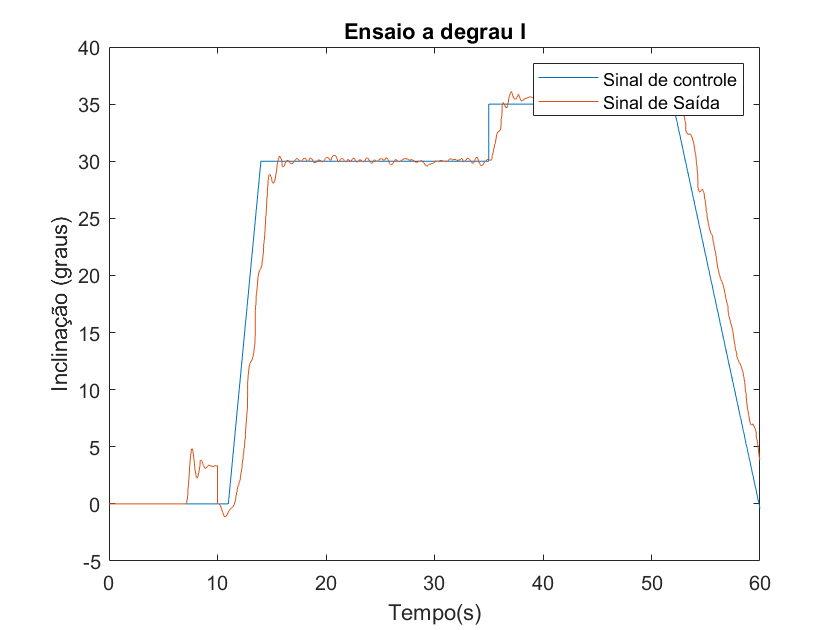
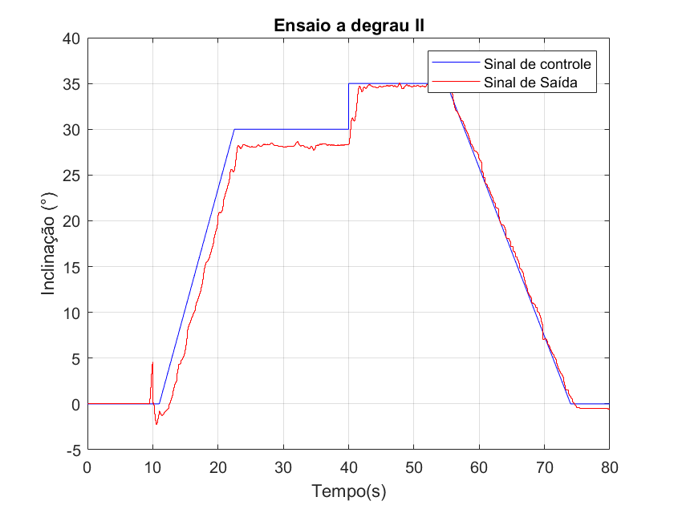
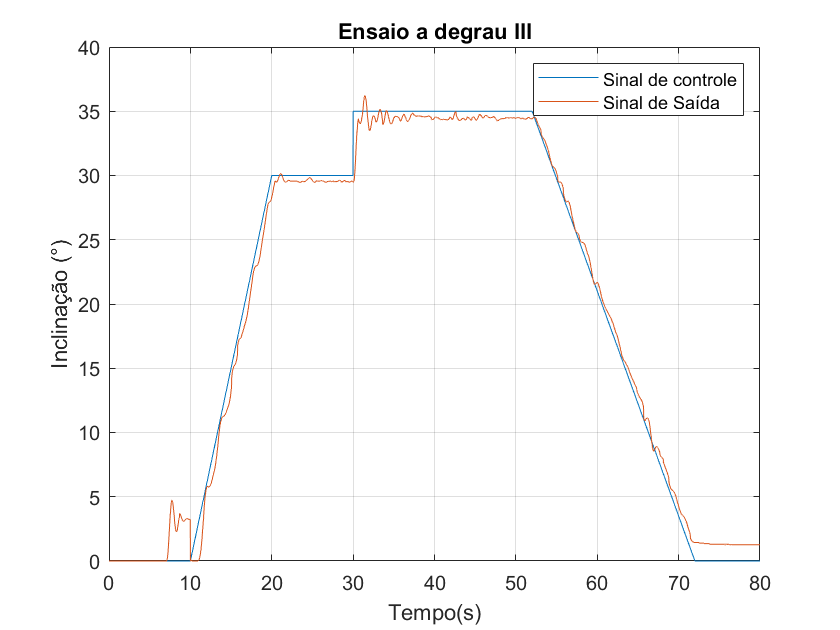
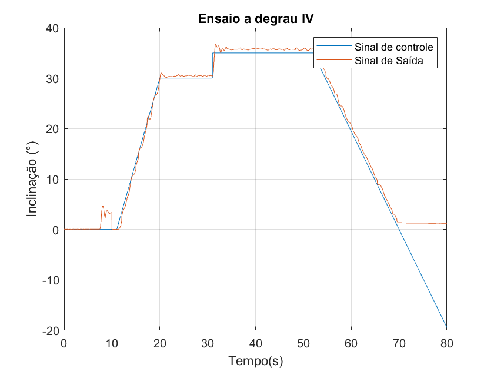
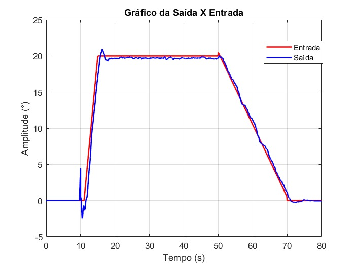
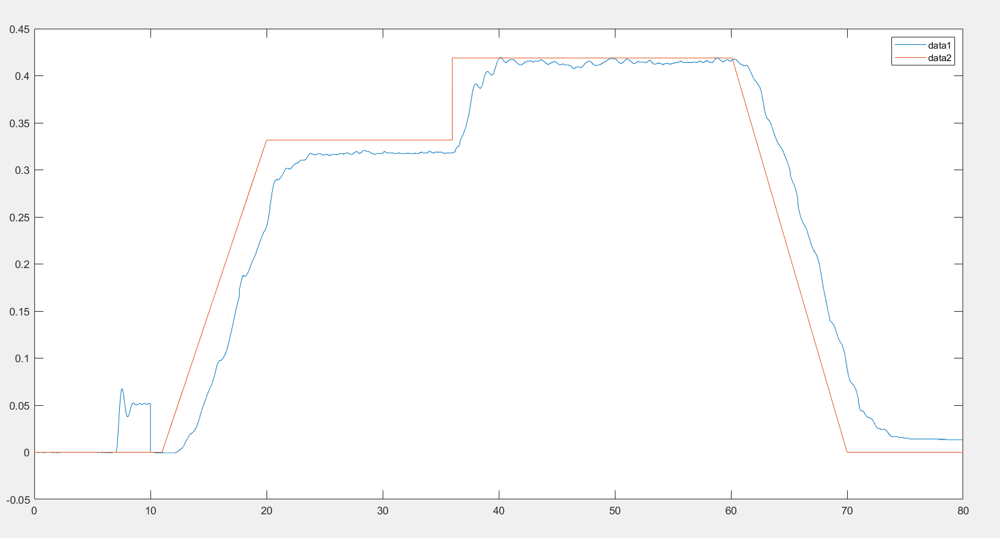

# Lab7

## Ponto de operação

Nesse lab vamos trabalhar com o ponto de operação $\bar{\theta} = 30$º. Faz-se necessário calcular o $\bar{u}$ necessário para que o aeropêndulo opere nesse ponto.

## Equipe de laboratório 13h30-15h10

### Yan, Vinicius e Peres

O arquivo <code>.mat</code> pode ser encontrado em [Git_Peres.mat](../resultados/time-1/lab-7/peres/Git_Peres.mat)

### Ferraresi, Renan, Valério

O arquivo <code>.mat</code> pode ser encontrado em [Git_Renan.mat](../resultados/time-1/lab-7/valerio/Git_Renan.mat)

### Emily, Emanuel, Paulo Vitor

O arquivo <code>.mat</code> pode ser encontrado em [Git_King.mat](../resultados/time-1/lab-7/king/Git_King.mat)

### Pedro Augusto, Pedro Augusto, Nando, Julio

O arquivo <code>.mat</code> pode ser encontrado em [Git_Pedros.mat](../resultados/time-1/lab-7/pedros/Git_Pedros.mat)

## Equipe de laboratório 15h30-17h10

### Implementação do Controlador

Para o projeto do controlador, se utilizou os parâmetros $\alpha$, $\beta$ e $\gamma$ que foram achados em laboratórios anteriores. Com a função de transferência da planta ($\alpha = 17.94$, $\beta = 1.82$ e $\gamma = 0.41$), se impôs para o controlador Notch as 3 condições que foram pedidas pelo professor: Erro em regime, Margem de fase e tempo de estabilização. Adotou-se como metodologia analisar inicialmente o erro em regime. Para esse ser menor que 5%, então teremos que $C(0)G(0) > 19$, onde C é a função de transferência do controlador e G a função da planta. Como: 

$$G(s) = \frac{\gamma}{s^2 + \beta s + \alpha} \frac{1}{s/5 + 1}$$

Sabemos então que $G(0) = \frac{\gamma}{\alpha}$, que é um valor conhecido. No caso do controlador Notch se adotou o procedimento de escolher o mesmo como sendo tal que:

$$C(s) = K\frac{s^2 + a}{s^2 + b s + c}$$

Dessa forma a condição de erro em regime nos leva então que 

$$Ka > 832 c$$

Adotamos então para esse caso que $K = 560, a = 25, c = 5$. Dessa maneira, só ficava $b$ para ser ajustado. Fez-se então uma pesquisa dos valores de $b$ que atenderiam o requisito de tempo de estabilização e margem de fase. Para isso se começou em valores pequenos e fomos subindo os mesmos chegando em um $b$ que atendeu os requisitos: $b = 180$. Do MATLAB, esse tempo foi de $3.57s$ e valor em regime de $0.985$ e margem de fase de 63 Graus. Dessa maneira, o controlador será tal que:

$$C(s) = 560\frac{s^2 + 25}{s^2 + 180 s + 5}$$

Esse foi o controlador projetado que deu os melhores resultados conforme atestado pelo professor e pelo gráfico da simulação abaixo:

Cabe aqui ressaltar que paralelamente, fora projetado outro controlador que tem como função de transferência padrão:

$$C(s) = K\frac{s^2 + d s + a}{s^2 + b s + c}$$

Entretanto para o projeto desse controlador, se utilizou os valores de $\alpha$, $\beta$ e $\gamma$ que foram estimados pelo ajuste do bode. Foi passado para nós que: $\alpha = 0.8437$, $\beta = 0.4056$ e $\gamma = 1.2066$. Nesse caso utilizamos a técnica de cancelamento dos zeros do controlador com os polos da função de transferência da planta de tal forma que ficamos uma função de segunda ordem (obs: Para essa hipótese só se modelou G como uma função de 2 ordem). Como fora atestado, o controle fora muito ruim de tal forma que se empregou o controlador de antes. Isso esteve relacionado com problemas na geração do diagrama de Bode gerado pelo time no laboratório 6.

## Controladores de cada grupo

### Arthur, Filipe e Matheus

$$C(s) = 560\frac{s^2 + 25}{s^2 + 180 s + 5}$$

### Douglas, Felipe e Pedro Pinheiro

$$C(s) = \frac{627.4s+8962}{230s+1}$$

### Gabriel, Guilherme Schwinn, Lucas

$$C(s) = \frac{71.16s^2+29.39s+1243}{s^3+11.06s^2+53.35s}$$

### Luiz, Ricardo e Victoria

$$C(s) = 100\frac{s + 5}{s^2 + 130 s}$$

## Objetivos

- Projeto de compensador utilizando diagrama de Bode

## Pré-Lab

### O grupo deve apresentar esse pré-lab antes de iniciar o experimento

Realize o projeto do compensador de modo a atender os seguintes requisitos:

1. margem de fase de pelo menos 60º
2. tempo de estabelecimento menor que 5 segundos
3. erro em regime permanente menor que 5%

Apresente um diagrama Simulink provando que o seu projeto funciona.

#### Sugestão:

O seu grupo pode fazer uso de um filtro notch. Sim, esse tema já foi abordado nas aulas práticas.

## No laboratório

### O que eu preciso fazer?

Testar o seu controlador.

## Vídeo explicativo

Por se tratar de um experimento simples, esse lab não tem vídeo explicativo.
