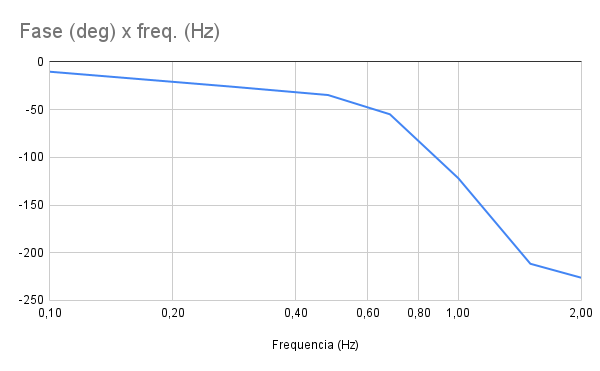
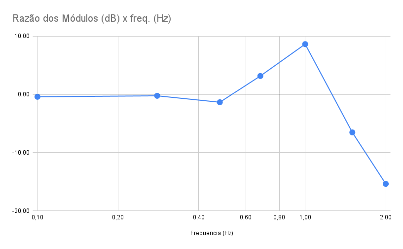

## Levantamento dos diagramas de Bode para a malha analisada

No laboratório da semana 7, foi realizado um levantamento experimental do diagrama de bode
para a malha de controle do sistema de controle de posição do braço ligado à um motor elétrico com hélice.

O diagram de bode foi levantado inputando o sistema com ondas senoidais de frequência e amplitude variáveis
e medindo a saída. A razão entre as amplitudes da saída e da entrada, bem como a diferença de fase entre elas,
foram medidas e plotadas em um gráfico de bode. Os diagramas obtidos foram os seguintes:

### Diagrama de Bode do grupo de segunda-feira, primeiro horário

#### Dados:

| Frequencia (Hz) | Razão dos Módulos (dB) | Fase (deg)   |
|-----------------|------------------------|--------------|
|            0,10 |                  -0,42 | -10,25021495 |
|            0,28 |                  -0,25 | -25,99509517 |
|            0,48 |                  -1,36 | -34,70978323 |
|            0,68 |                   3,15 | -54,88935677 |
|            1,00 |                   8,62 | -121,9818727 |
|            1,50 |                  -6,53 | -211,5589363 |
|            2,00 |                 -15,37 | -226,2487323 |

#### Gráficos:

O diagrama obtido, ainda, como esperado, mostra características de um sistema de terceira ordem
no intervalo dado, visto a queda de -270° na fase e uma queda de aproximadamente -60 dB/dec na magnitude,
após a frequência de corte.