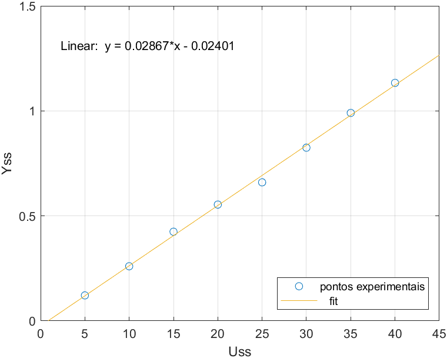

# Determinação dos parâmetros do modelo do aeropêndulo

## Modelo do aeropêndulo

Após a modelagem física do aeropêndulo, chega-se na seguinte EDO não linear que descreve o comportamento do sistema:

$\ddot{\theta}(t) = -\alpha sin(\theta(t)) - \beta \dot{\theta}(t) + \gamma \omega^2(t)$

## Levantamento da curva estática

A fim de levantar a curva estática do sistema, para validar o modelo acima, considere $\dot{\theta}(t) = \ddot{\theta}(t) = 0$. Com isso, tem-se a seguinte equação:

$sin(\theta(t)) = \frac{\gamma}{\alpha} \omega^2(t)$

Para obter uma função do controle $u_{ss}$ em relação à saída (${\theta}$), realizou-se um ensaio para verificar essa saída, em equilíbrio, para diferentes valores de controle. Os resultados obtidos estão ilustrados na tabela abaixo.

| $u_{ss}$ | ${y_{ss, 1}}$ | ${y_{ss, 2}}$ | ${y_{ss, 3}}$ | ${y_{ss, médio}}$ |
|:-------:|:-------:|:-------:|:-------:|:-------:|
| 5% | 6,97° | 6,84° | 7,06° | 6.96° |
| 10% | 14,76° | 14,94° | 15,03° | 14,91° |
| 15% | 25,42° | 24,39° | 23,18° | 24,33° |
| 20% | 31,27° | 31,05° | 32,89° | 31,74° |
| 25% | 37,71° | 37,62° | 38,07° | 37,80° |
| 30% | 46,75° | 47,97° | 47,07° | 47,26° |
| 35% | 56,79° | 56,88° | 56,56° | 56,74° |
| 40% | 64,97° | 64,75° | 65,11° | 64,94° |

A partir desses dados obtidos, realizou-se um fit linear dos dados, obtendo-se a seguinte expressão, para $y_{ss}$ em radianos:

$y_{ss} = 0.02867 u_{ss} - 0.02401$

Graficamente, o fit realizado é ilustrado pela figura abaixo:

Alternativamente, pode-se escrever $u_{ss}$ em função de $y_{ss}$, obtendo a curva a seguir:

$u_{ss} = 34.81 y_{ss} + 0.883$

## Função de transferência do sistema

Aplicando, na EDO não linear que descreve o sistema, a linearização de Taylor em torno do ponto de equilíbrio $(\overline{u}, \overline{\theta})$, chega-se na seguinte função de transferência:

$\frac{\Delta \theta(s)}{\Delta U(s)} = \frac{\gamma}{s^2 + \beta s + \alpha cos(\overline{\theta})}$

## Determinação dos parâmetros do modelo do aeropêndulo

A fim de determinar os parâmetros $\alpha$, $\beta$ e $\gamma$, realizou-se o ensaio a dregrau em torno dos pontos de operação correspondentes aos ângulos de equilíbrio de 20° e 40°. Pelo fit linear realizado, os valores de controle que correspondem a esses pontos de equilíbrio são, respectivamente, 11,34% e 23,51%.

Para a determinção dos parâmetros, foram usados os valores de tempo de pico e de sobressinal de cada ensaio degrau. Para acessar a pasta com os dados brutos utilizados na obtenção desses valores, [clique aqui](./dados/).

### Determinação do parâmetro $\alpha$

Para o parâmetro $\alpha$, os valores obtidos estão representaods pela tabela a seguir:

|  $\overline{y}$  | $\alpha_1$ | $\alpha_2$ | $\alpha_3$ | $\alpha_4$ | $\alpha_{médio}$ |
|:-------:|:-------:|:-------:|:-------:|:-----------:|:-----------:|
| 20° | 30,46 | 17,36 | 19,36 | 19,67 | 21,71 |
| 40° | 30,41 | 16,73 | 19,14 | 32,79 | 24,77 |

Dessa forma, o valor médio de $\alpha$ dos dois pontos de equilíbrio é 23,24.

### Determinação do parâmetro $\beta$

Para o parâmetro $\beta$, os valores obtidos estão representaods pela tabela a seguir:

|  $\overline{y}$  | $\beta_1$ | $\beta_2$ | $\beta_3$ | $\beta_4$ | $\beta_{médio}$ |
|:-------:|:-------:|:-------:|:-------:|:-----------:|:-----------:|
| 20° | 4,18 | 1,89 | 1,49 | 2,68 | 2,56 |
| 40° | 1,42 | 1,40 | 1,22 | 1,40 | 1,36 |

Dessa forma, o valor médio de $\beta$ dos dois pontos de equilíbrio é 1,96.

### Determinação do parâmetro $\gamma$

Para o parâmetro $\gamma$, os valores obtidos estão representaods pela tabela a seguir:

|  $\overline{y}$  | $\gamma_1$ | $\gamma_2$ | $\gamma_3$ | $\gamma_4$ | $\gamma_{médio}$ |
|:-------:|:-------:|:-------:|:-------:|:-----------:|:-----------:|
| 20° | 0,91 | 0,47 | 0,55 | 0,62 | 0.64 |
| 40° | 0,47 | 0,46 | 0,45 | 0,50 | 0,47 |

Dessa forma, o valor médio de $\gamma$ dos dois pontos de equilíbrio é 0,56.

### Resumo

Portanto, os valores que serão adotados para os parâmetro são os da tabela a seguir:

| $\alpha$ | $\beta$ | $\gamma$ |
|:-------:|:-------:|:-------:|
| 23,24 | 1,96 | 0,56 |

