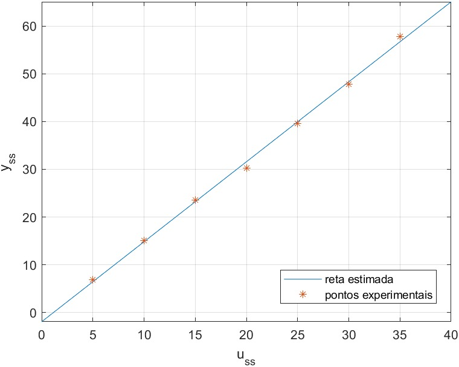

# Obtenção dos parâmetros do modelo de um aeropêndulo

Após o processo de modelagem, verificou-se que $\ddot{\theta}(t) = -\alpha sin(\theta (t))-\beta \dot{\theta}(t) + \gamma\omega^2(t)$ representa o comportamento não-linear desse sistema. Fazendo a consideração que $\dot{\theta}(t) = \ddot{\theta}(t) = 0$, ou seja, considerando valores estacionários, temos:

$$ sin(\theta(t)) = \frac{\gamma}{\alpha}\omega^2(t)$$

## Curva estática
Para validar o modelo encontrado, fez-se o levantamento da curva estática através de ensaios com aplicação de diferentes sinais de controle contantes (entradas do tipo degrau) e medidas das saídas (em graus). Os resultados coletados foram colocados na tabela abaixo:

| $u_{ss}$ | $y_{ss}$ | $y_{ss}$ | $y_{ss}$ |
|:--------------:|:--------------:|:--------------:|:--------------:|
|       5%       |      6,9º      |      6,8º      |      6,8º      |
|       10%      |      15,1º     |      15,2º     |      14,9º     |
|       15%      |      23,7º     |      23,5º     |      23,6º     |
|       20%      |      30,4º     |      30,4º     |      30,1º     |
|       25%      |      40,3º     |      39,5º     |      38,9º     |
|       30%      |      47,5º     |      48,0º     |      47,9º     |
|       35%      |      57,8º     |      58,1º     |      57,7º     |

Através da análise dos pontos experimentais, fez-se uma regressão linear e a reta encontrada que melhor se ajustou aos valores encontrados foi: 

$$y_{ss} = 1.6753\cdot u_{ss} -1.9287$$

Graficamente, temos:

## Linearização do modelo e cálculo dos parâmetros

Aplicando a linearização de Taylor em torno do ponto de operação ($\overline{u}$,$\overline{\theta}$) à EDO obtida para o modelo e igualando a função de transferência esperada para um sistema de segunda ordem, temos: 
 
$$\frac{\Delta\theta(t)}{\Delta U(s)} = \frac{\gamma}{s^2 + \beta s + \alpha cos(\overline{\theta})} = \frac{K \omega_n^2}{s^2 + 2w_n\xi + \omega_n^2}$$

Com isso, o cálculo dos parâmetros é feito da seguinte forma:

$$ \alpha = \frac{\omega_n^2}{cos(\overline{\theta})} $$
$$ \beta = 2\omega_n\xi $$
$$ \gamma = K\omega_n^2$$

## Obtenção dos parâmetros

Foram feitos ensaios experimentais para dois pontos de operação: $\overline{y}$ = 20% e $\overline{y}$ = 40%. Usando a reta obtida anteriormente, encontrou-se os valores de $\overline{y}$, conforme a tabela:

|$y_{ss}$ | $u_{ss}$ |
|:--------------:|:--------------:| 
|       20%      |      13.09º     |    
|       40%      |      25.03º     |  

Através dos gráficos de saída, obteve-se os dados de tempo de pico ($t_p$) e sobressinal ($M_p$). Com esses dados, pode-se encontrar os parâmetros $\omega_n$ e $\xi$, e assim, consequentemente, $\alpha$, $\beta$ e $\gamma$, conforme as seguintes relações:

$$ \xi = \sqrt{\frac{log(M_p)^2}{\pi^2+(log(M_p)^2)}} $$
$$ \omega_n = \frac{\pi}{tp\sqrt{1-\xi^2}} $$

Dessa forma, obteve-se os seguintes parâmetros para $\alpha$, $\beta$ e $\gamma$:

|  $\overline{y}$  | $\alpha_1$ | $\alpha_2$ | $\alpha_3$ | $\alpha_4$ | $\alpha_{médio}$ |
|:---:|:----------:|:----------:|:----------:|:----------:|:----------------:|
| 20º |    22,02   |    19,22   |    20,20   |    21,00   |    20,61    |
| 40º |    20,27   |    22,81   |    19,62   |    23,45   |    21,54    |

|  $\overline{y}$  | $\beta_1$ | $\beta_2$ | $\beta_3$ | $\beta_4$ | $\beta_{médio}$ |
|:---:|:---------:|:---------:|:---------:|:---------:|:---------------:|
| 20º |   2,47   |    1,95   |    2,36   |    1,80   |       2,14       |
| 40º |   1,15   |    0,66   |    1,29   |    2,94   |       1,51       |

|  $\overline{y}$  | $\gamma_1$ | $\gamma_2$ | $\gamma_3$ | $\gamma_4$ | $\gamma_{médio}$ |
|:---:|:---------:|:---------:|:---------:|:---------:|:---------------:|
| 20º |   0,59    |    0,47   |    0,54   |    0,09   |       0,42      |
| 40º |   0,43    |    0,70   |    0,40   |    0,09   |       0,40      |

Em resumo, os valores médios encontrados para os parâmetros de todos os ensaios realizados foram:

$\alpha$ | $\beta$ | $\gamma$ |
:---------:|:---------:|:---------:|
|  21,08    |   1,82   |    0,41   |  

